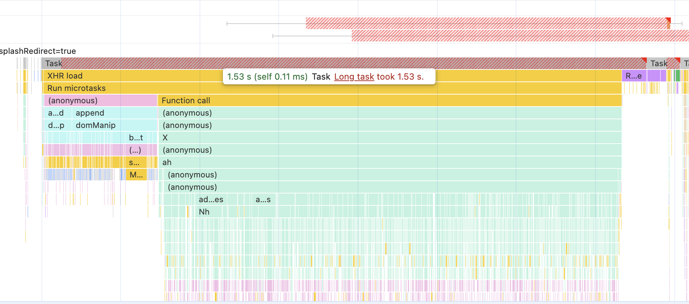

## Issue #1

The first issue is to do with Layout or Reflows, and they are caused by the using the DOM API calls for anything that needs to recalculate the size of elements, such as:
- offsetHeight()
- getBoundingClientRect()
- getComputedStyle().getPropertyValue()

and then writing to `element.style` directly.

We can solve this by doing all our reads first, and the deferring the writes using the browser provided: `requestAnimationFrame` (supported by Chrome and Safari)

There are 2 files I noticed (so far) that caused expensive reflows, they are:
- [HeaderContainer.js](./src/HeaderContainer.js)
- [CatalogEntryListStyleHeight.js](./src/CatalogEntryListStyleHeight.js)

Each file contains the current code and below it the suggested implementation to fix the expensive Layout reflows, click the respective links above to view in this repo


## Issue #2


The second issue is that `dillards.js` has long running tasks, consider breaking these up into smaller chunks

see `https://vice-prod.sdiapi.com/vice_loader/dillards/dillards`

and from devtools: `dillards:3:15179` for the column mapping to source location


The long task at 1.53 seconds in red shows a large amount of js code running (green) below it, digging into to it the dillars.js has tons of `addedNodes` calls, that wind up blocking the main thread and causes some pretty high inp numbers, over 1.5 seconds.

This was evident on both typing into the search bar (at times) and also operating the hamburger menu (also at times).  Depending on the client's hardware, they will experience jank, or non-responsive actions, during their visit.

The source of the issue can be misleading as the `quantum` analytics scripts wrap the javascript calls.  On drilling all the way to the bottom of the call stack reveals the `dillards.js` script was doing the actual work.




Consider an approach like this to yield control back to the browser, thereby breaking up the execution:

```js
for (let i = 0; i < items.length; i++) {
  doNodeManipulationWork(items[i]);

  // yield:
  if (i % 100 === 0) {
    await new Promise(r => setTimeout(r, 0));
  }
}
```

for Chrome, we can call `requestIdleCallback` to yield to the main thread more frequently, though support in Safari is not currently available